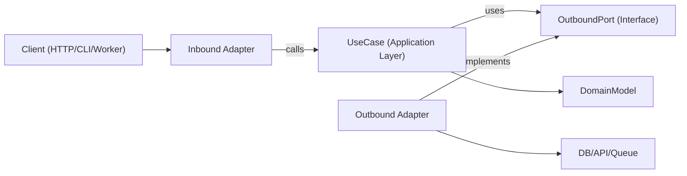

# Hexagonal Architecture (TypeScript / Node)

Hexagonal architecture (Ports and Adapters) keeps business logic independent from frameworks, transport, and persistence. The core depends on abstract ports; adapters implement those ports at the edges.

## When to Use

- New features where long-term maintainability and testability matter.
- Refactoring layered/framework-heavy code where domain logic is mixed with I/O.
- Supporting multiple interfaces for the same use case (HTTP, CLI, queue workers, cron jobs).
- Replacing infrastructure (DB, external APIs, message bus) without rewriting business rules.

## Core Concepts

- **Domain model** — business rules and entities/value objects. No framework imports.
- **Use cases (application layer)** — orchestrate domain behavior and workflow steps.
- **Inbound ports** — contracts describing what the application can do (commands/queries/use-case interfaces).
- **Outbound ports** — contracts for dependencies the app needs (repositories, gateways, event publishers, clock, UUID).
- **Adapters** — infrastructure and delivery implementations of ports (HTTP controllers, DB repositories, queue consumers, SDK wrappers).
- **Composition root** — single wiring location where concrete adapters are bound to use cases.

Outbound port interfaces usually live in the application layer (or domain only when the abstraction is truly domain-level); infrastructure adapters implement them.

Dependency direction is always inward:

- Adapters → application/domain
- Application → port interfaces (inbound/outbound contracts)
- Domain → domain-only abstractions (no framework/infra dependencies)
- Domain → nothing external

## How It Works

1. **Model a use case boundary.** Define one use case with a clear input/output DTO. Keep transport details (`req`, GraphQL `context`, job payload wrappers) outside the boundary.
2. **Define outbound ports first.** Identify every side effect as a port: persistence (`UserRepositoryPort`), external calls (`BillingGatewayPort`), cross-cutting (`LoggerPort`, `ClockPort`). Ports model capabilities, not technologies.
3. **Implement the use case as pure orchestration.** The use case receives ports via constructor/arguments, validates application-level invariants, coordinates domain rules, and returns plain data.
4. **Build adapters at the edge.** Inbound adapter converts protocol input to use-case input; outbound adapter maps app contracts to concrete APIs/ORM/query builders. Mapping stays in adapters, never in use cases.
5. **Wire in a composition root.** Instantiate adapters, then inject into use cases. Keep wiring centralized to avoid hidden service-locator behavior.
6. **Test per boundary.** Unit-test use cases with fake ports; integration-test adapters with real infra; E2E through inbound adapters.

## Architecture Diagram



## Suggested Module Layout

Feature-first organization with explicit boundaries:

```text
src/
  features/
    orders/
      domain/
        Order.ts
        OrderPolicy.ts
      application/
        ports/
          inbound/  CreateOrder.ts
          outbound/ OrderRepositoryPort.ts  PaymentGatewayPort.ts
        use-cases/  CreateOrderUseCase.ts
      adapters/
        inbound/  http/createOrderRoute.ts
        outbound/ postgres/PostgresOrderRepository.ts  stripe/StripePaymentGateway.ts
      composition/ ordersContainer.ts
```

## TypeScript Example

### Port definitions

```typescript
export interface OrderRepositoryPort {
  save(order: Order): Promise<void>
  findById(orderId: string): Promise<Order | null>
}

export interface PaymentGatewayPort {
  authorize(input: { orderId: string; amountCents: number }): Promise<{ authorizationId: string }>
}
```

### Use case (pure orchestration)

```typescript
type CreateOrderInput = { orderId: string; amountCents: number }
type CreateOrderOutput = { orderId: string; authorizationId: string }

export class CreateOrderUseCase {
  constructor(
    private readonly orderRepository: OrderRepositoryPort,
    private readonly paymentGateway: PaymentGatewayPort,
  ) {}

  async execute(input: CreateOrderInput): Promise<CreateOrderOutput> {
    const order = Order.create({ id: input.orderId, amountCents: input.amountCents })

    const auth = await this.paymentGateway.authorize({
      orderId: order.id,
      amountCents: order.amountCents,
    })

    // markAuthorized returns a new Order; it does not mutate in place.
    const authorizedOrder = order.markAuthorized(auth.authorizationId)
    await this.orderRepository.save(authorizedOrder)

    return { orderId: order.id, authorizationId: auth.authorizationId }
  }
}
```

### Outbound adapter (infra-specific mapping lives here)

```typescript
export class PostgresOrderRepository implements OrderRepositoryPort {
  constructor(private readonly db: SqlClient) {}

  async save(order: Order): Promise<void> {
    await this.db.query(
      'insert into orders (id, amount_cents, status, authorization_id) values ($1, $2, $3, $4)',
      [order.id, order.amountCents, order.status, order.authorizationId],
    )
  }

  async findById(orderId: string): Promise<Order | null> {
    const row = await this.db.oneOrNone('select * from orders where id = $1', [orderId])
    return row ? Order.rehydrate(row) : null
  }
}
```

### Composition root (explicit wiring — no hidden globals)

```typescript
export const buildCreateOrderUseCase = (deps: { db: SqlClient; stripe: StripeClient }) => {
  const orderRepository = new PostgresOrderRepository(deps.db)
  const paymentGateway = new StripePaymentGateway(deps.stripe)
  return new CreateOrderUseCase(orderRepository, paymentGateway)
}
```

## Anti-Patterns to Avoid

- Domain entities importing ORM models, web framework types, or SDK clients.
- Use cases reading directly from `req`, `res`, or queue metadata.
- Returning database rows directly from use cases without domain/application mapping.
- Adapters calling each other directly instead of flowing through use-case ports.
- Spreading dependency wiring across many files with hidden global singletons.

## Migration Playbook (no big-bang rewrites)

1. Pick one vertical slice (single endpoint/job) with frequent change pain.
2. Extract a use-case boundary with explicit input/output types.
3. Introduce outbound ports around existing infrastructure calls.
4. Move orchestration logic from controllers/services into the use case.
5. Keep old adapters, but make them delegate to the new use case.
6. Add tests around the new boundary (unit + adapter integration).
7. Repeat slice-by-slice.

- **Strangler approach**: route one use case at a time through new ports/adapters.
- **Facade first**: wrap legacy services behind outbound ports before replacing internals.
- **Composition freeze**: centralize wiring early so new dependencies don't leak inward.
- **Slice selection rule**: prioritize high-churn, low-blast-radius flows first.
- **Rollback path**: keep a reversible toggle/route switch per migrated slice until verified in production.

## Testing Guidance (same hexagonal boundaries)

- **Domain tests** — entities/value objects as pure business rules (no mocks, no framework setup).
- **Use-case unit tests** — orchestration with fakes/stubs for outbound ports; assert outcomes and port interactions.
- **Outbound adapter contract tests** — define a shared contract suite at the port level, run it against each adapter implementation.
- **Inbound adapter tests** — verify protocol mapping (HTTP/CLI/queue payload → use-case input, and output/error mapping back).
- **Adapter integration tests** — real infrastructure (DB/API/queue) for serialization, schema/query behavior, retries, timeouts.
- **Refactor safety** — add characterization tests before extraction; keep until new boundary behavior is stable.

## Best Practices Checklist

- Domain and use-case layers import only internal types and ports.
- Every external dependency is represented by an outbound port.
- Validation occurs at boundaries (inbound adapter + use-case invariants).
- Use immutable transformations (return new values/entities, don't mutate shared state).
- Errors are translated across boundaries (infra errors → application/domain errors).
- Composition root is explicit and easy to audit.
- Use cases are testable with simple in-memory fakes for ports.
- Language/framework specifics stay in adapters, never in domain rules.
